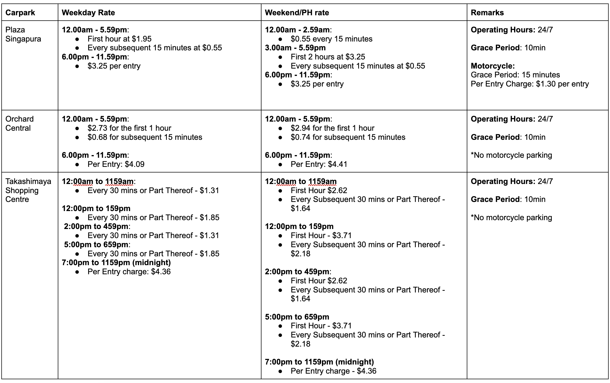
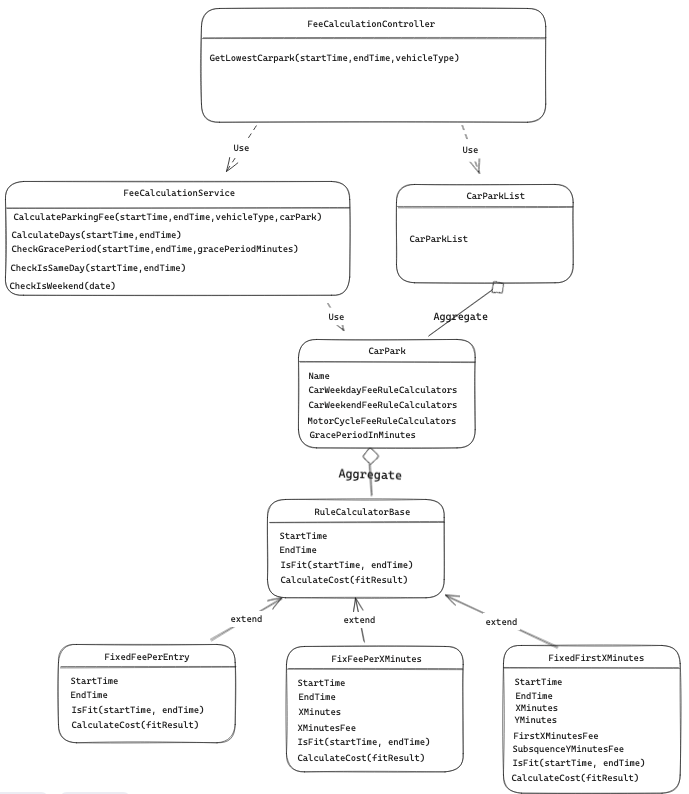
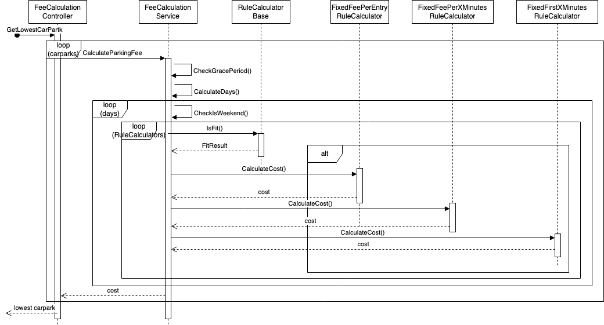

# Parking Fee Calculator

You are tasked to build a Parking Fee Calculator, that will help to calculate parking fees and thus help users decide where to park.
These are the carparks that will be considered in this application:



For each of the car park, it has different parking rules, the rules for weekday and weekend are also different, in general there are three kinds of parking rule, 

**Fixed per entry**: Per Entry charge - $4.36

**Fixed first X minutes, then subsequent Y mins charge**: 
First hour(X=60) at $1.95
Every subsequent 15 minutes(Y=15) at $0.55

**Fixed per X minutes**: $0.55 every 15 minutes(X=15)

## Project Structure

```
PARKING-FEE-CALCULATOR-CSHARP
├── ParkingFeeCalculator
│   ├── Controllers
│   │   └── FeeCalculationController.cs
│   ├── Models
│   │   └── FeeRuleCalculators
|   │       └── FixedFeePerEntryRuleCalculator.cs
|   │       └── FixedFeePerXMinutesRuleCalculator.cs
|   │       └── FixedFirstXMinutesRuleCalculator.cs
|   │       └── RuleCalculatorBase.cs
│   │   └── ... other models
│   ├── Services
│   │   └── FeeCalculationService.cs
│   │   └── IFeeCalculationService.cs
│   ├── Utilities
│   │   └── DateTimeUtility.cs
│   │   └── DecimalUtility.cs
│   ├── Program.cs
├── ParkingFeeCalculator.Tests
│   ├── ApiTests
│   │   └── FeeCalculatorApiTest.cs
│   ├── ... test files
└── README.md
```

## File Descriptions

- `Program.cs`: this is the application file to run it as the asp.net web api, and the place to register the dependency injection containers
- `Controllers/FeeCalculationController.cs`: This file exports a class `FeeCalculationController` which has a method `GetLowestCarpark` that handles the `/api/feeCalculator/getLowestCarpark` route of the application and returns the lowest carpark fee.
- `Models/FeeRuleCalculators/RuleCalculatorBase.cs`: This file  implements the `IsFit` method, which returns the time period that falls within the ruleset, or a false result if the inputted time period does not fall within the ruleset at all.
- `Models/FeeRuleCalculators/FixedFeePerEntryRuleCalculator.cs`: This file defines the ruleset for which there is a fixed fee per entry for the time period defined in the ruleset.
- `Models/FeeRuleCalculators/FixedFeePerXMinutesRuleCalculator.cs`: This file defines the ruleset for which there is a fixed fee per X minutes for the time period defined in the ruleset. Each block will be rounded up (i.e. if X=15, if the parking duration is 50minutes, it will be counted as 4 blocks of X)
- `Models/FeeRuleCalculators/FixedFirstXMinutesRuleCalculator.cs`: This file defines the ruleset for which there is a fixed fee for the first X minutes, and thereafter the remaining time is charged for another fixed fee per Y minutes. Similarly, each block will be rounded up. (i.e. if X=60 and Y=15, if the parking duration is 110minutes the parking charge will be xFee + 4 \* yFee).
- `Services/IFeeCalculationService.cs`: This is the interface which include a `CalculateParkingFee` method, to calculate the parking fee based on the `startTime` `endTime` `vehicleType` and `carPark`
- `Services/FeeCalculationService.cs`: This implements the IFeeRuleCalculator interface
- `Utilities/DateTimeUtility.cs`: This file provide an extension method `ToTimeOnly()` for the `DateTime` type to convert the `DateTime` the time part to the `TimeOnly` type
- `Utilities/DecimalUtility.cs`: This file provide an extension method `ToTwoDecimalPlaces()` for the `decimal` type to fix it to 2 decimal places

## Class Diagram


## Time Sequence Diagram


## Install(Visual Studio Code Configuration)

1. install C# Dev Kit extension(https://marketplace.visualstudio.com/items?itemName=ms-dotnettools.csdevkit)
2. install .net install tool(https://marketplace.visualstudio.com/items?itemName=ms-dotnettools.vscode-dotnet-runtime)

## Build

```
cd ParkingFeeCalculator
dotnet build
```

## Run(under `ParkingFeeCalculator` folder)
```
dotnet run
```

it will run localhost, like `http://localhost:5180`, 
can access the swagger by `http://localhost:[port]/swagger/`
can access the api by `http://localhost:[port]/api/feeCalculator/getLowestCarpark`

## Test
```
cd ParkingFeeCalculator.Tests
dotnet test
```

## How to use it
You need to finish 3 tasks. if all 3 tasks finished, when you run the test in `ParkingFeeCalculator.Tests/Services/FeeCalculationServiceTest.cs`, the test will pass!

### Task 1
---
can checkout the branch `step1` to start

```bash
git checkout step1
```

#### Requirement
You need to implement the `CalculateCost` method in `FixedFirstXMinutesRuleCalculator.cs`, it based on the rule `first X mintues charge a fixed amount, for the subsequence, each Y mintues will charge a fee`, for example:

10:00 - 16:00: 

First 2 hour at $5

Every subsequent 15 minutes at $0.55

X=120, Y=15

**test case:**

entryTime: 10:00, exitTime: 13:07

10:00-12:00: $5

12:01-13:07 (1*4+1)*0.55=$2.75

in total: 5+2.75=$7.75

#### Definiation of Done
all test cases in `FixedFirstXMinutesRuleCalculatorTest.cs` are passed

### Task 2
---
**you can continue your implementation without the checkout command if you finished `step1`, or start directly by checkout the branch `step2`**

```bash
git checkout step2
````

#### Requirement

You need to implement the `IsFit` method inside the `RuleCalculatorBase` class, it's to comparing the input startTime and endTime, whether it fit the current rule, if yes, need to return the actual start time and actual end time,

for example:
rule configed: 10:00-13:00

case 1:
input param: startTime: 9:00, endTime: 9:59
output: `{ isFit: false }`

case 2:
input param: startTime: 9:00, endTime: 11:01
output: `{ isFit: true, startTime: 10:00, endTime: 11:01 }`

#### Definition of Done
All the test cases in `RuleCalculatorBaseTest.cs` are passed

### Task 3
---
**you can continue your implementation without the checkout command if you finished `step2`, or start directly by checkout the branch `step3`**

```bash
git checkout step3
```

#### Requirement
You need to finish the final logic, the `CalculateParkingFee` method in `FeeCalculationService` to calculate the parking fee, can refer the time sequence diagram above
1. need to check whether it's within grace peroid, if yes return 0, the `CheckGracePeriod` method will return true if it's within grace period
2. need to check whether it's weekend, if yes need to use the weekend day rule instead of the week day, the `CheckIsWeekend` method will return true if it's weekend
3. split the start time and end time into days with `CalculateDays` method
4. iterate the rules with each days and sum the result

**Test cases:**

entryTime = "2021-01-01T10:00";

exitTime = "2021-01-02T11:00";

parking in plazaSingapura

**day 1:**

10:00-11:00: 1.95

11:01-17:59: 7\*4*0.55 = 15.40

18:00-23:59: 3.25

**day 2:**

00:00-02:59: 3\*4*0.55 = 6.60

3:00-5:00: 3.25

5:01-11:00: 6\*4*0.55 = 13.2

total: 1.95 + 15.40 + 3.25 + 6.60 + 3.25 + 13.2 = 43.65

#### Definition of Done
All the test cases in `FeeCalculationServiceTest.cs`(unit test) are all passed
and the test cases in `FeeCalculatorApiTest.cs`(api test) are passed

